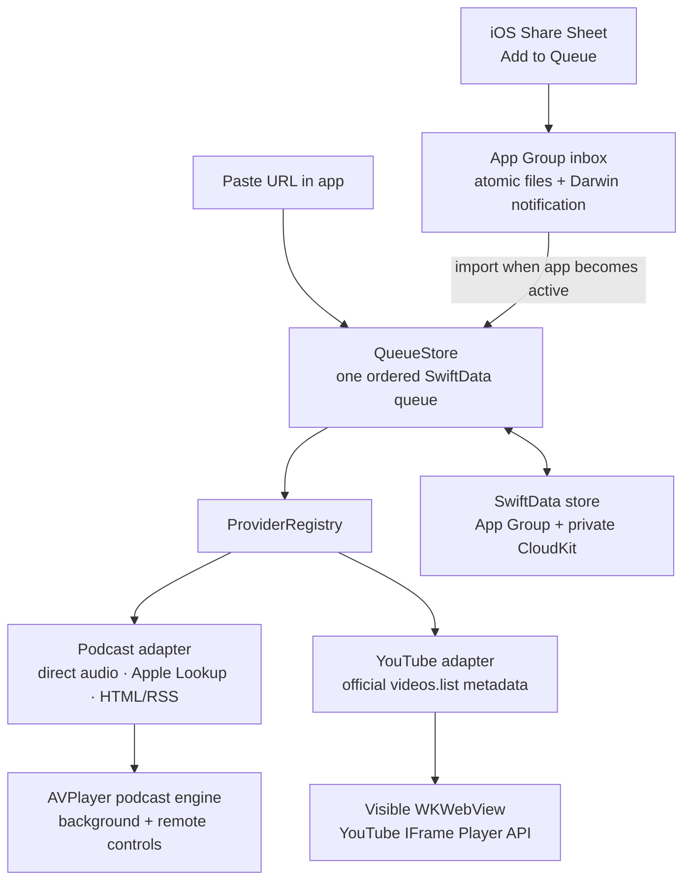

# Listen Later

Listen Later is a native iPhone app with one ordered queue for podcast episodes
and YouTube videos. It is intentionally not a discovery app: add a public URL
from the iOS Share Sheet or paste one into the app, then press Play.

The minimum deployment target is iOS 17 because the app uses SwiftData. The app
is built with SwiftUI, SwiftData and CloudKit; podcasts use AVFoundation and
MediaPlayer; YouTube uses the official YouTube Data API and IFrame Player API.

> [!IMPORTANT]
> YouTube does not permit third-party API clients to extract audio, download
> videos, or keep a YouTube player running while it is hidden or in the
> background. Consequently, the exact “audio-only, lock-screen, uninterrupted”
> experience is available for podcasts only. See
> [YouTube playback and policy](#youtube-playback-and-policy).

## Architecture



Key implementation boundaries:

- `ListenLaterShare` validates one shared public HTTPS URL and quickly writes a
  `PendingShare` file into the App Group. It does not perform network resolution
  or write to CloudKit while the host app is holding the extension open.
- The containing app drains the inbox on launch/activation and immediately when
  the running process receives the cross-process notification. Receipt IDs make
  crash recovery idempotent before metadata resolution begins.
- Podcast resolution supports direct audio URLs, Apple Podcasts episode links
  through Apple’s Lookup API, standard HTML RSS/Atom discovery, and RSS enclosure
  matching.
- YouTube URL parsing yields a video ID. Public title, channel, artwork,
  duration, embedding status, and made-for-kids status come only from the
  official YouTube Data API `videos.list` endpoint.
- `QueueStore` persists queue order, item state, and playback progress. A
  CloudKit-backed SwiftData store synchronizes those values through the user’s
  private iCloud database; foreground refreshes reconcile remote changes.

## YouTube playback and policy

Policy behavior was reviewed on July 30, 2026. Re-check the current policies
before each release.

YouTube’s [Developer Policies](https://developers.google.com/youtube/terms/developer-policies)
prohibit API clients from separating YouTube audio from video, downloading or
extracting media, and playing YouTube content in a background player that is not
displayed on the screen the user is viewing. The
[Required Minimum Functionality](https://developers.google.com/youtube/terms/required-minimum-functionality)
also requires a visible official player, an OS-provided WebView on Apple
platforms, a viewport of at least 200 by 200 points/pixels, unobscured controls,
client identity, and visibility before scripted autoplay.

Listen Later therefore behaves as follows:

- A YouTube queue item stores a video ID, never an audio or downloadable media
  URL.
- Playback uses YouTube’s official
  [IFrame Player API](https://developers.google.com/youtube/iframe_api_reference)
  in a visible `WKWebView`, with YouTube controls and branding intact.
- Leaving the app, locking the device, or moving the player off screen pauses
  YouTube playback. The app clears Now Playing information and disables
  lock-screen/Bluetooth remote commands for YouTube.
- If a podcast finishes while the device is locked and the next item is a
  YouTube video, the queue waits for the app to return to the foreground.
- Foreground auto-advance is attempted only while the player is visible.
  WebKit/YouTube may still block autoplay; the app then asks the user to tap
  Play.
- A video whose official `status.embeddable` value is false is marked
  unavailable and skipped.
- As a conservative product safeguard, a video whose official
  `status.madeForKids` value is true is handed off to the official YouTube app
  or website instead of being embedded. This is a Listen Later product choice,
  not a claim that every made-for-kids embed is categorically prohibited.
- Listen Later does not scrape YouTube pages, suppress advertisements, alter the
  player, cache video, download media, or isolate an audio track.
- It displays each video’s current API metadata without aggregating YouTube
  durations into a cross-source queue total or deriving a completion metric
  from Data API duration. Playback completion comes from the official player’s
  terminal event.

The combined queue remains useful and ordered, but a fully continuous
background queue across a YouTube boundary is not possible under the current
YouTube rules. This is the closest seamless behavior that preserves the
official audiovisual player and its playback context.

Relevant official references:

- [YouTube API Services Terms of Service](https://developers.google.com/youtube/terms/api-services-terms-of-service)
- [YouTube API Services Developer Policies](https://developers.google.com/youtube/terms/developer-policies)
- [YouTube API Services Required Minimum Functionality](https://developers.google.com/youtube/terms/required-minimum-functionality)
- [YouTube video resource: `embeddable` and `madeForKids`](https://developers.google.com/youtube/v3/docs/videos)
- [YouTube IFrame Player API](https://developers.google.com/youtube/iframe_api_reference)

## Requirements

- Xcode with the iOS 17 SDK or newer
- An active Apple Developer Program membership with permission to create App
  Groups and iCloud containers
- An iPhone or iPad signed into iCloud for CloudKit and background-audio
  validation
- A Google Cloud project with YouTube Data API v3 enabled
- A restricted YouTube Data API key

Simulator builds are useful for UI and deterministic tests. They are not
sufficient evidence for CloudKit delivery, Share Sheet behavior across host
apps, lock-screen controls, Bluetooth routing, interruptions, or App Store
signing.

## API key setup

The app reads `YOUTUBE_API_KEY` through `Config/Base.xcconfig`. Keep the actual
key in the ignored local file:

```sh
cp Config/Secrets.xcconfig.example Config/Secrets.xcconfig
```

Then edit `Config/Secrets.xcconfig`:

```xcconfig
YOUTUBE_API_KEY = YOUR_KEY_HERE
```

Do not put the key in `Base.xcconfig`, source code, a committed scheme, or the
README. `Config/Secrets.xcconfig` is already ignored by Git.

Create the key:

1. In [Google Cloud Console](https://console.cloud.google.com/), create or
   select the project for this app.
2. Enable **YouTube Data API v3**. Google’s
   [Data API overview](https://developers.google.com/youtube/v3/getting-started)
   describes the project, credentials, and quota model.
3. Create a standard API key under **APIs & Services > Credentials**.
4. Set **API restrictions** to **YouTube Data API v3** only.
5. Set **Application restrictions** to **iOS apps** and allow the containing
   app’s exact bundle identifier, `com.kevinthau.ListenLater`. Requests made
   with an iOS-restricted key must send the matching
   `X-Ios-Bundle-Identifier` header.
6. Monitor quota and rejected requests. Use separate development and production
   credentials; do not create extra projects to evade quota.

Google recommends both API and application restrictions in its
[API key security documentation](https://docs.cloud.google.com/docs/authentication/api-keys#api_key_restrictions).
An API key shipped in an iOS app can still be extracted. Restrictions, quotas,
monitoring, and rotation limit its usefulness; the `.xcconfig` file prevents
accidental source-control disclosure but does not make the compiled key secret.

The current app uses only public, non-authorized YouTube metadata. It does not
sign the user into Google or request OAuth scopes. Podcast-only use does not
need a YouTube key; adding or refreshing YouTube items does.

The app also identifies the embedded player by loading its HTML with an HTTPS
bundle-ID origin and passing the same origin to the IFrame Player API. YouTube
player error `153` usually means that this client identity/referrer context is
missing or rejected. Verify both the bundle identifier and API-key restriction
before changing the player implementation.

## Signing, identifiers, and capabilities

Use unique explicit bundle identifiers under one Apple Developer team. The
Share Extension identifier must begin with the containing app’s identifier.
Select **Automatically manage signing** unless the organization deliberately
manages profiles itself.

The checked-in project contains these targets and identifiers:

| Target | Product | Bundle identifier |
| --- | --- | --- |
| `ListenLater` | Containing iOS app | `com.kevinthau.ListenLater` |
| `ListenLaterShare` | “Add to Queue” Share Extension | `com.kevinthau.ListenLater.AddToQueue` |
| `ListenLaterTests` | Unit-test bundle | `com.kevinthau.ListenLaterTests` |

The repository’s shared identifiers are:

```xcconfig
APP_GROUP_IDENTIFIER = group.com.kevinthau.ListenLater
ICLOUD_CONTAINER_IDENTIFIER = iCloud.com.kevinthau.ListenLater
```

If you use a different organization or bundle identifier, update the following
as one coordinated change:

- All three target bundle identifiers
- `APP_GROUP_IDENTIFIER` and `ICLOUD_CONTAINER_IDENTIFIER` in
  `Config/Base.xcconfig`
- The App Group and iCloud container registrations in the Apple Developer
  portal
- The `com.apple.developer.ubiquity-kvstore-identifier` value in
  `ListenLater/ListenLater.entitlements`
- The iOS bundle identifier allowed by the Google API key
- Provisioning profiles for both targets

Configure the containing app target:

- **App Groups**: enable `group.com.kevinthau.ListenLater`
- **iCloud**: enable CloudKit and select
  `iCloud.com.kevinthau.ListenLater`
- **Background Modes**: enable **Audio, AirPlay, and Picture in Picture** and
  **Remote notifications**

Configure the Share Extension target:

- **App Groups**: enable the exact same App Group
- Do not give the extension background-audio or CloudKit capabilities; it uses
  the shared inbox and the containing app performs resolution and persistence.

Apple documents these steps in
[Adding capabilities](https://developer.apple.com/documentation/xcode/adding-capabilities-to-your-app),
[Configuring App Groups](https://developer.apple.com/documentation/xcode/configuring-app-groups),
and [Syncing SwiftData across devices](https://developer.apple.com/documentation/swiftdata/syncing-model-data-across-a-persons-devices).

After changing capabilities, clean the build folder, let Xcode regenerate
profiles, and inspect the signed app and extension entitlements if the runtime
falls back to local-only storage.

## CloudKit setup and schema promotion

The app requests a SwiftData `ModelConfiguration` in the App Group container,
backed by the user’s private CloudKit database. If CloudKit setup fails, it
falls back first to an App Group local store and then to an app-sandbox store.
That fallback keeps the app usable, but it can hide an entitlement mistake.
Open **Playback & Sync** in the app and confirm **CloudKit sync: Active** before
considering setup complete.

While the app is foregrounded, it refreshes its SwiftData queue snapshot every
five seconds so imported CloudKit changes are reflected without requiring a
scene transition. CloudKit transport itself remains asynchronous.

Development setup:

1. Confirm the containing app’s iCloud entitlement contains
   `iCloud.com.kevinthau.ListenLater`, and the `remote-notification` background
   mode is present.
2. Run a normal, non-demo Debug build on an unlocked device signed into iCloud.
3. Add and mutate queue items so SwiftData initializes and exercises the
   development schema.
4. Open [CloudKit Console](https://icloud.developer.apple.com/), select the
   container and **Development** environment, and inspect the generated record
   types and fields.
5. Test create, update, reorder, progress, unavailable state, and delete flows
   on two unlocked devices using the same iCloud account. CloudKit sync is
   asynchronous; allow time for background import/export.

Before TestFlight or App Store distribution:

1. Freeze and review the model shape. CloudKit-backed SwiftData does not support
   uniqueness enforcement, and relationships would need to be optional.
2. In CloudKit Console, select **Deploy Schema Changes**, review the changes,
   and deploy them to **Production**.
3. Build an archive signed for distribution and verify its iCloud container
   environment and entitlements.
4. Test the production environment with TestFlight on at least two devices.

App Store builds can access only the production schema. Deploying the schema
copies types, fields, and indexes, not development records. Production schemas
are effectively additive: plan migrations before promotion because deployed
types and fields cannot simply be removed. See Apple’s
[schema deployment guide](https://developer.apple.com/documentation/cloudkit/deploying-an-icloud-container-s-schema).

## Share Extension setup and verification

The extension display name is **Add to Queue**. Its activation rule accepts one
web URL. It also attempts a plain-text URL when a host supplies text rather than
`public.url`.

After installing the containing app:

1. Open Listen Later once.
2. In Safari, Podcasts, YouTube, or another host app, open the Share Sheet.
3. If needed, choose **More**, enable **Add to Queue**, and pin it to favorites.
4. Share a public HTTPS URL and select **Add to Queue**.
5. Wait for the “Added to Queue” confirmation, then activate Listen Later.
6. Confirm the item appears at the bottom and changes from resolving to ready or
   unavailable.

If the extension reports that the App Group is unavailable, verify that both
targets are signed by the same team, both profiles include the same registered
App Group, and the extension is embedded in the containing app.

The extension intentionally returns quickly after an atomic inbox write and
posts a payload-free Darwin notification. A running containing app stages the
receipt promptly—even during active background podcast playback—and then
resolves metadata. If iOS has suspended or terminated the app, the durable file
is imported on its next activation. Damaged inbox files are moved to a
quarantine directory instead of being retried forever. Apple’s extension guide
documents [App Group data sharing and activation rules](https://developer.apple.com/library/archive/documentation/General/Conceptual/ExtensibilityPG/ExtensionScenarios.html).

## Podcast background audio

Podcast enclosures play through `AVPlayer` with an `AVAudioSession` configured
as `.playback` and `.spokenAudio`. The app publishes podcast Now Playing
metadata and supports play, pause, next, seek, 15-second back, 30-second forward,
and playback-rate commands through `MPRemoteCommandCenter`.

The containing app’s `audio` background mode lets an active podcast continue
when the screen locks or the app backgrounds. The code also handles audio
interruptions, pauses when an old output route becomes unavailable, and marks
an item unavailable after a 30-second startup/rebuffer watchdog expires so the
queue can continue. AirPlay and Bluetooth A2DP are enabled.

These capabilities apply only to podcast audio. Do not enable or simulate
background YouTube playback. See Apple’s
[AVAudioSession guidance](https://developer.apple.com/documentation/avfaudio/avaudiosession)
and [background execution modes](https://developer.apple.com/documentation/xcode/configuring-background-execution-modes).

## Running the app

1. Configure signing, capabilities, CloudKit, and the YouTube API key as
   described above.
2. Open `ListenLater.xcodeproj` in Xcode.
3. Select the `ListenLater` scheme and a simulator or signed device.
4. Build and run.

Command-line build:

```sh
xcodebuild \
  -project ListenLater.xcodeproj \
  -scheme ListenLater \
  -destination 'platform=iOS Simulator,name=iPhone 17 Pro' \
  build
```

If that simulator is not installed, replace the destination with one listed by
`xcrun simctl list devices available`.

### Simulator demo queue

Add `-DemoQueue` to **Product > Scheme > Edit Scheme > Run > Arguments Passed On
Launch**. Demo mode uses an in-memory SwiftData store and inserts three
representative queue rows. It skips CloudKit, pending Share Extension imports,
and YouTube metadata refresh.

Demo mode is for deterministic UI inspection and screenshots. Its example
podcast URLs are not playable media, changes disappear on termination, and it
must not be used to validate persistence, providers, playback, or sync.

## Running tests

From Xcode, select the `ListenLater` scheme and choose **Product > Test**.

Command line:

```sh
xcodebuild \
  -project ListenLater.xcodeproj \
  -scheme ListenLater \
  -destination 'platform=iOS Simulator,name=iPhone 17 Pro' \
  test
```

The 59-test automated suite is deterministic and does not require a live API
key or network access:

- `ProviderParsingTests` covers supported and hostile YouTube URL forms,
  canonicalization, and duration parsing.
- `ProviderRegistryTests` covers provider dispatch plus invalid and unsupported
  URLs.
- `RSSFeedTests` covers RSS/Atom fixtures, enclosures, metadata, matching hints,
  and malformed XML.
- `QueueStoreTests` uses an in-memory SwiftData container for append, reorder,
  Play Next, delete, played state, unavailable state, progress throttling,
  YouTube completion boundaries, and refreshes from another model context.
- `PlaybackCoordinatorPodcastEngineTests` uses a fake podcast engine for resume,
  completion, failure/skip, seeking, rate, and the foreground-only YouTube
  boundary.
- `SharedQueueInboxTests` verifies chronological atomic-file handoff and retry
  behavior, cross-process notifications, receipt-idempotent relaunch recovery,
  multi-receipt staging, and malformed-file quarantine.

The provider adapters accept an injected `URLSession` so network response tests
can be added without live services. Live YouTube, CloudKit, Share Sheet,
lock-screen, and Bluetooth behavior belong in the real-device checklist below.

## Real-device release checklist

### Installation and configuration

- [ ] Install a non-demo build on two supported devices using the same iCloud
  account.
- [ ] Confirm **CloudKit sync: Active** and **YouTube API: Configured**.
- [ ] Confirm an iOS-restricted key succeeds and rejected-key/quota errors are
  understandable.
- [ ] Confirm the production build contains the intended app, extension, App
  Group, iCloud, and background-mode entitlements.

### Share and resolution

- [ ] Share one podcast episode URL from Safari or a podcast site.
- [ ] Share Apple Podcasts and direct enclosure URLs.
- [ ] Share YouTube watch, short, live, mobile, and `youtu.be` URLs.
- [ ] Confirm rapid extension completion and import when Listen Later activates.
- [ ] Confirm unsupported, malformed, authenticated, deleted, and
  non-embeddable items become unavailable and the queue continues.
- [ ] Turn off networking during resolution, then retry from the item menu.

### Podcast playback

- [ ] Resume a partially played episode after terminating and relaunching.
- [ ] Lock the device and verify uninterrupted podcast audio.
- [ ] Verify lock-screen and Control Center play/pause, position, rate, back,
  forward, and next controls.
- [ ] Verify Bluetooth headphones/car audio and AirPlay routing.
- [ ] Disconnect headphones and confirm playback pauses.
- [ ] Test phone/Siri/alarm interruptions and route restoration.
- [ ] Let an item finish and confirm automatic advance.
- [ ] Make an enclosure fail during playback and confirm unavailable marking
  and skip-to-next behavior.

### YouTube playback

- [ ] Confirm the visible official player is at least 200 by 200 and all YouTube
  controls/branding remain usable and unobscured.
- [ ] Confirm metadata, duration, `embeddable`, and made-for-kids behavior come
  from `videos.list`.
- [ ] Background and lock the device; verify YouTube pauses and no YouTube
  lock-screen remote controls remain.
- [ ] Verify an autoplay-blocked transition presents a tap-to-play state.
- [ ] Verify non-embeddable and removed videos are marked unavailable and
  skipped.
- [ ] Verify made-for-kids items offer **Open in YouTube**.
- [ ] Finish a foreground YouTube item and verify foreground queue advance.
- [ ] Finish a background podcast immediately before a YouTube item and verify
  the app waits for foreground rather than playing YouTube invisibly.

### Queue and sync

- [ ] Reorder, delete, mark played/unplayed, and move an item to Play Next.
- [ ] Verify every item’s independent playback position.
- [ ] Confirm queue changes and progress reach the second device.
- [ ] Make edits on both devices close together and inspect deterministic order
  and last-write behavior.
- [ ] Test while signed out of iCloud and after signing back in.
- [ ] Confirm local-only fallback is visible rather than mistaken for active
  sync.

## Metadata retention and privacy release requirements

The app stores the user’s original URLs, ordered queue, playback progress, and
resolved metadata locally and in the user’s private CloudKit database. It
parses a YouTube video ID from the user-provided URL. Public YouTube API data
stored by the app includes title, channel name, thumbnail URL, duration,
embeddability, and made-for-kids status. It does not currently request Google
login or authorized YouTube account data.

YouTube’s
[Developer Policies](https://developers.google.com/youtube/terms/developer-policies)
require limited non-authorized API data to be deleted or refreshed within 30
calendar days. Listen Later schedules a refresh when cached YouTube metadata is
29 days old. Cleanup runs on launch, activation, and periodically while the app
process is active. If refresh still cannot succeed once the cached data reaches
30 days, the app clears the stored YouTube title, channel, thumbnail, duration,
fetch date, and API status flags, then marks the item unavailable. It retains
the user-provided URL, its parsed video ID, and the queue record so the user can
retry or delete the saved reference. As with any client-only iOS app, work is
not guaranteed while the process is suspended or never reopened; a strict
server-enforced deadline would require a backend metadata service.

Before distributing the app, publish and require acceptance of an easily
accessible privacy policy and terms surface. The current information screen
links the YouTube Terms and Google Privacy Policy, but it is not itself a
complete published app privacy policy and does not yet provide the
release-required acceptance flow. The policy must, at minimum:

- State that the app uses YouTube API Services.
- Link to the [YouTube Terms of Service](https://www.youtube.com/t/terms) and
  state that use of the YouTube feature is subject to those terms.
- Link to the [Google Privacy Policy](https://policies.google.com/privacy).
- Explain exactly which URLs, queue data, progress, and API metadata the app
  stores; that queue data syncs through the user’s private iCloud database; and
  how users delete it.
- Explain that the visible YouTube player communicates playback context to
  YouTube/Google and may use cookies or similar device/browser storage.
- Identify network requests to Google/YouTube, Apple’s Lookup API, podcast
  publishers, RSS hosts, audio CDNs, artwork hosts, and Apple iCloud.
- Provide a developer contact and a clear deletion-request process.
- If OAuth or authorized YouTube data is added later, link Google’s
  [security permissions page](https://security.google.com/settings/security/permissions),
  implement revocation, and delete authorized data within the policy deadlines.

Also complete App Store Connect’s App Privacy answers from the final behavior
and published policy. Do not treat this developer README as the user-facing
privacy policy or legal terms.

## Known MVP limitations

- YouTube cannot play in the background, from the lock screen, as audio-only
  media, or while its official player is hidden. A YouTube boundary can pause
  the otherwise continuous queue.
- WebKit or YouTube can require a fresh user gesture even when foreground
  autoplay is requested.
- Private, age-restricted, region-restricted, live-state-restricted, removed, or
  embedding-disabled YouTube videos may fail or require the official YouTube
  app.
- Made-for-kids videos are conservatively handed to YouTube rather than embedded.
- A valid API key and available quota are required to add new YouTube metadata.
- Generic podcast page resolution depends on a discoverable RSS/Atom link and a
  confident match to an episode enclosure. JavaScript-only pages, private feeds,
  paywalls, unusual feeds, and pages with no standards-based feed discovery can
  fail.
- Direct audio URLs may not provide show, artwork, or duration metadata until
  playback.
- Plain HTTP podcast pages, feeds, and enclosures are rejected. Listen Later
  intentionally requires public HTTPS URLs and does not weaken App Transport
  Security with a blanket exception.
- A running app receives Share Extension additions through a cross-process
  notification. If iOS has suspended or terminated it, additions remain safely
  in the App Group inbox until the next activation.
- CloudKit sync is asynchronous rather than real-time. Simultaneous queue
  reorders or progress writes on several devices use normal SwiftData/CloudKit
  conflict behavior rather than a collaborative CRDT; foreground queue
  snapshots are refreshed every five seconds.
- The MVP streams media and does not download podcasts for offline listening.
- There are no recommendations, discovery feeds, accounts, CarPlay UI, Apple
  Watch app, or macOS-specific interface.
- CloudKit production schema promotion and the in-app YouTube privacy/terms
  acceptance flow are release gates, not optional polish.

## Production references

- [Apple: Adding capabilities to your app](https://developer.apple.com/documentation/xcode/adding-capabilities-to-your-app)
- [Apple: Configuring App Groups](https://developer.apple.com/documentation/xcode/configuring-app-groups)
- [Apple: Syncing SwiftData across a person’s devices](https://developer.apple.com/documentation/swiftdata/syncing-model-data-across-a-persons-devices)
- [Apple: Deploying an iCloud container schema](https://developer.apple.com/documentation/cloudkit/deploying-an-icloud-container-s-schema)
- [Apple: Configuring background execution modes](https://developer.apple.com/documentation/xcode/configuring-background-execution-modes)
- [Apple: Configuring an app for media playback](https://developer.apple.com/documentation/avfoundation/configuring-your-app-for-media-playback)
- [Apple: Remote command center](https://developer.apple.com/documentation/mediaplayer/mpremotecommandcenter)
- [Apple: Share Extension data sharing and activation](https://developer.apple.com/library/archive/documentation/General/Conceptual/ExtensibilityPG/ExtensionScenarios.html)
- [Apple: iTunes Search API lookup examples](https://developer.apple.com/library/archive/documentation/AudioVideo/Conceptual/iTuneSearchAPI/LookupExamples.html)
- [YouTube: Data API overview](https://developers.google.com/youtube/v3/getting-started)
- [YouTube: `videos.list`](https://developers.google.com/youtube/v3/docs/videos/list)
- [YouTube: Video resource](https://developers.google.com/youtube/v3/docs/videos)
- [YouTube: Made for Kids status](https://developers.google.com/youtube/v3/guides/made_for_kids_status)
- [YouTube: IFrame Player API](https://developers.google.com/youtube/iframe_api_reference)
- [YouTube: Developer Policies](https://developers.google.com/youtube/terms/developer-policies)
- [YouTube: Required Minimum Functionality](https://developers.google.com/youtube/terms/required-minimum-functionality)
